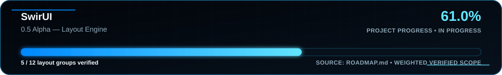

<!-- SWIR-README-STANDARD:v2 -->

<div align="center">


# ⚡ SwirUI

### Native, reactive and GPU-first desktop UI framework for Python

**Python public API • Rust + wgpu native core • High-refresh desktop rendering**


[](https://github.com/Swir/Swirui/actions/workflows/ci.yml)


</div>


## Project Status



**68% authoritative weighted project progress — 0.6 Alpha Reactive Runtime is complete; 0.7 Alpha Animation Engine is underway with 6 / 12 groups verified.**

- `0.1 Alpha — Foundation` ✅
- `0.2 Alpha — Native Window + First Renderer` ✅
- `0.3 Alpha — Visual Engine` ✅
- `0.4 Alpha — Core Widgets` ✅
- `0.5 Alpha — Layout Engine` ✅
- `0.6 Alpha — Reactive Runtime` ✅
- `0.7 Alpha — Animation Engine` 🚧 `6 / 12`

The published 68% value preserves the verified weighting documented in `ROADMAP.md` through completed 0.5. Completed 0.6 and verified 0.7 functionality are tracked by their milestone checklists until an explicit project-weighting extension is documented; later work is never double-counted or used to invent release readiness.

SwirUI remains **pre-alpha**. Public APIs may still change while the animation and professional-widget layers are developed. There is no public GitHub Release yet.

## Overview

SwirUI is being built as a complete Python desktop application framework rather than a visual skin over Tkinter, Qt or another widget toolkit. Python stays the public developer API while Rust, wgpu and PyO3 own performance-critical native rendering work.

The Windows renderer uses a persistent per-window wgpu context and retained SceneGraph. Linux/X11 and macOS/Cocoa already provide real native window and input backends. GPU presentation on Linux/macOS and Wayland support remain future work and are not claimed as complete.

The completed 0.5 layout layer provides content-aware intrinsic measurement, min/max constraints, responsive compact/desktop/ultrawide policies, adaptive navigation, dynamic typography, DPI-stable logical spacing and revision-aware layout caching. The completed 0.6 runtime adds computed state, async/persistent state, dynamic dependency tracking, batched transactions, reactive properties, bindings, observable collections, retained component lifecycle hooks and transaction-scoped minimal-update scheduling. The active 0.7 animation layer now includes elapsed-time tweens, analytical spring motion, inertial decay, serial/parallel composition, cancellation/chaining, retained hover/press/focus animation and deterministic retained particle effects.

## Highlights

| Area | Current verified capability |
|---|---|
| Native windows | Direct Win32, X11 and Cocoa/AppKit backends without Tkinter, Qt or SDL |
| GPU renderer | Persistent Rust/wgpu renderer context on Windows with retained scene submission |
| Shapes | Anti-aliased rounded rectangles plus convex/concave `Path2D` geometry |
| Text | Persistent shaped Unicode text through glyphon/cosmic-text |
| Images | Content-addressed RGBA GPU cache with aliases, telemetry and safe lifetime management |
| Composition | Hierarchical clipping, cumulative opacity and painter-order retained composition |
| HiDPI | Logical-DIP public geometry with physical-pixel native/GPU conversion |
| Displays | Multi-monitor mapping, refresh discovery and 60/120/144+ Hz display-aware pacing |
| Visual Engine | Gradients, shadows, glow, bloom, depth, parallax, reflections and adaptive lighting |
| Materials | Native backdrop blur, `FrostedGlass` and `Acrylic` with deterministic grain |
| Post-processing | Persistent scene blur, affine RGBA color filters and validated custom WGSL effects |
| Custom shaders | Bounded Python `CustomShaderEffect` API, native Naga validation, persistent GPU pass and bounded pipeline reuse |
| Core widgets | Retained Text/Label, Button/IconButton, text inputs, toggles, Slider/RangeSlider, progress, surfaces, ScrollView, Accordion, SplitView, Modal/Dialog and Toast/Notification |
| Layout engine | Row/Column, Stack/Grid/Wrap, DockPanel/Flow/Overlay, ConstraintLayout, intrinsic sizing, min/max constraints and optimized retained reflow |
| Responsive UI | Logical-DIP breakpoints, compact/desktop/ultrawide variants, adaptive navigation and `DynamicTypography` |
| Reactive runtime | `State`, `ComputedState`, `AsyncState`, `PersistentState`, dependency tracking, transactions, bindings, observable collections and retained lifecycle hooks |
| Animation runtime | Elapsed-time `Tween`, analytical `SpringAnimation`, inertial `DecayAnimation`, serial/parallel composition, cancellation/chaining, event-driven interaction animation and deterministic retained particles |
| Performance | Adaptive visual-quality profiles plus retained effect/GPU caches and layout-preparation revision caching |
| Accessibility | Semantic roles/tree, keyboard focus routing, keyboard-only traversal, checked state, numeric value/range and dialog/alert semantics |

## Quick Start

### Python development environment

```powershell
git clone https://github.com/Swir/Swirui.git
cd Swirui
python -m venv .venv
.venv\Scripts\activate
python -m pip install --upgrade pip
python -m pip install -e ".[dev]"
```

Run the native-window demo:

```powershell
python examples/native_window_demo.py
```

Try the retained widgets, layout engine, reactive runtime and animation foundation:

```powershell
python examples/core_widgets_demo.py
python examples/layout_row_column_demo.py
python examples/layout_advanced_demo.py
python examples/responsive_layout_demo.py
python examples/adaptive_navigation_demo.py
python examples/dynamic_typography_demo.py
python examples/reactive_runtime_demo.py
python examples/async_persistent_state_demo.py
python examples/component_lifecycle_demo.py
python examples/animation_timing_demo.py
python examples/physics_animation_demo.py
python examples/interaction_animation_demo.py
python examples/particle_animation_demo.py
```

### Windows GPU development

The verified wgpu presentation path currently targets Windows. Build the PyO3 extension into the active environment:

```powershell
python -m pip install maturin==1.15.0
cd native
maturin develop --release
cd ..
python examples/gpu_rectangles_demo.py
```

Try the custom-shader runtime after building the native extension:

```powershell
python examples/gpu_custom_shader_demo.py
```

## Requirements & Compatibility

| Area | Status |
|---|---|
| Python | 3.11, 3.12, 3.13 and 3.14 are tested in CI |
| Windows | Native Win32 backend + verified Rust/wgpu presentation path |
| Linux | Native X11 window/input backend verified under Xvfb |
| macOS | Native Cocoa/AppKit window/input backend with Retina logical geometry |
| Wayland | Planned |
| Linux/macOS GPU presentation | Planned; not yet claimed |
| Native GPU build | Stable Rust toolchain + Maturin + PyO3 ABI3 |

## Usage

### Foundation API

```python
from swirui import App, AppConfig, Component, State, Window

counter = State(0)
app = App(name="SwirUI Demo", config=AppConfig(target_fps=120))
window = Window(title="Future starts here", width=1100, height=720)
root = Component("dashboard")
window.set_root(root)
app.add_window(window)
counter.subscribe(lambda value: print("Counter:", value))
counter.set(1)
app.run()
```

### Reactive runtime

```python
from swirui import State, computed, state_transaction

price = State(12.0)
quantity = State(2)
discount = State(0.0)
subtotal = computed(lambda: price.value * quantity.value)
total = computed(lambda: subtotal.value * (1.0 - discount.value))

total.subscribe(lambda value: print(f"Total: {value:.2f}"), immediate=True)
with state_transaction():
    price.set(15.0)
    quantity.set(3)
    discount.set(0.10)
```

Computed dependencies are discovered from reads performed by the computation. Nested transactions coalesce notifications and dependency-ordered computed recomputation at the outer boundary. `bind()` and `bind_bidirectional()` return disposable binding handles, observable collections publish immutable/defensive snapshots, `AsyncState` models asynchronous loading/error/value transitions and `PersistentState` provides schema-versioned atomic JSON persistence.

### Animation timing and physics

```python
from swirui import AnimationParallel, SpringAnimation, State, Tween, ease_in_out_cubic

position = State(0.0)
opacity = State(0.0)
intro = AnimationParallel(
    SpringAnimation(0.0, 320.0, position.set, stiffness=180.0, damping=22.0),
    Tween(0.0, 1.0, 0.35, opacity.set, easing=ease_in_out_cubic),
).start()

intro.advance(1.0 / 120.0)
```

Animation primitives consume elapsed seconds rather than frame counts. Spring and inertial-decay sampling use closed-form equations, so samples at the same elapsed time remain deterministic across different frame partitions. Completion, cancellation, serial chaining and parallel composition preserve unused frame time where applicable.

### Retained layout example

```python
from swirui import Button, CrossAxisAlignment, Insets, Row, Window, mount
from swirui.rendering import Rect

window = Window(title="Layout", width=720, height=360)
row = Row(
    bounds=Rect(0, 0, 1, 1),
    fill_viewport=True,
    padding=Insets.symmetric(horizontal=32, vertical=120),
    spacing=16,
    cross_alignment=CrossAxisAlignment.STRETCH,
)
row.add(
    Button("Primary", bounds=Rect(0, 0, 160, 48)).set_layout_grow(1),
    Button("Secondary", bounds=Rect(0, 0, 160, 48)).set_layout_grow(2),
)
mount(window, row)
```

Layout geometry remains in logical DIPs. The retained layout pass runs before child SceneGraph compilation, so arranged bounds are used by rendering and hit testing without recreating the native GPU context.

### Bounded custom WGSL effect

```python
from swirui.rendering import CustomShaderEffect, WgpuRenderer

source = """
fn swirui_effect(
    color: vec4<f32>,
    uv: vec2<f32>,
    params: vec4<f32>,
) -> vec4<f32> {
    let gain = 1.0 + params.x;
    return vec4<f32>(color.rgb * gain, color.a);
}
"""

effect = CustomShaderEffect(source, parameters=(0.15, 0.0, 0.0, 0.0))
renderer = WgpuRenderer(custom_shader=effect)
```

## GPU and Runtime Examples

```text
examples/reactive_runtime_demo.py
examples/async_persistent_state_demo.py
examples/component_lifecycle_demo.py
examples/animation_timing_demo.py
examples/physics_animation_demo.py
examples/interaction_animation_demo.py
examples/particle_animation_demo.py
examples/core_widgets_demo.py
examples/core_toggles_demo.py
examples/range_progress_demo.py
examples/core_surfaces_demo.py
examples/core_scroll_view_demo.py
examples/expander_accordion_demo.py
examples/core_split_view_demo.py
examples/core_overlays_demo.py
examples/layout_row_column_demo.py
examples/layout_panels_demo.py
examples/layout_advanced_demo.py
examples/responsive_layout_demo.py
examples/adaptive_navigation_demo.py
examples/dynamic_typography_demo.py
examples/gpu_rectangles_demo.py
examples/gpu_text_demo.py
examples/gpu_image_demo.py
examples/gpu_paths_demo.py
examples/gpu_gradients_demo.py
examples/gpu_mesh_gradients_demo.py
examples/gpu_depth_demo.py
examples/gpu_reflections_demo.py
examples/gpu_dynamic_effects_demo.py
examples/gpu_bloom_demo.py
examples/gpu_noise_demo.py
examples/gpu_adaptive_lighting_demo.py
examples/gpu_scene_blur_demo.py
examples/gpu_backdrop_blur_demo.py
examples/gpu_glass_materials_demo.py
examples/gpu_color_filters_demo.py
examples/gpu_custom_shader_demo.py
examples/gpu_native_effect_frame_cache_demo.py
examples/adaptive_quality_demo.py
examples/high_refresh_demo.py
```

## Technology & Architecture

```text
Python Application API
        │
        ├── App / Window / Component / State / ComputedState
        ├── retained widgets + complete 0.5 layout API
        ├── responsive layout / adaptive navigation / dynamic typography
        ├── async/persistent state + bindings / observable collections
        ├── retained lifecycle + minimal-update scheduling
        ├── elapsed-time animation + analytical spring / decay
        ├── routed input + accessibility semantics
        └── runtime configuration + adaptive visual quality
        │
SwirUI Runtime
        │
        ├── reactive dependency tracking + batched transactions
        ├── intrinsic measure → arrange + min/max constraints
        ├── animation sequencing / parallel composition / frame controller
        ├── event-driven interaction animation + retained particles
        ├── compact / desktop / ultrawide logical-DIP policies
        ├── revision-aware retained layout invalidation cache
        ├── Win32 / X11 / Cocoa native backends
        ├── logical DIP ↔ physical pixel boundary
        ├── retained RenderTree / SceneGraph
        └── display-aware frame scheduler
        │
Renderer Layer
        │
        ├── persistent Windows wgpu context
        ├── rectangles / paths / shaped text / images
        ├── blur / backdrop / glass / acrylic
        ├── gradients / depth / lighting / bloom / color filters
        ├── validated custom WGSL post-processing
        └── retained GPU/effect/pipeline caches
        │
Native Core
        │
        └── Rust 2024 + wgpu 30 + PyO3 ABI3
```

## Testing & Quality

Every significant runtime change is expected to preserve the existing quality gates:

- Ruff and strict Mypy
- pytest on Python 3.11–3.14
- deterministic weighted progress-SVG verification against `ROADMAP.md`
- retained-runtime performance budgets with JSON reports
- `cargo check` and `cargo test`
- Maturin / PyO3 native build
- real Linux/X11 and macOS/Cocoa native-window smoke tests
- real Win32 + wgpu smoke tests
- integrated 0.2 native renderer/runtime gate
- HiDPI, multi-monitor, presentation-policy, text, image, path, effects and cache coverage
- retained widget interaction, accessibility and real Win32 input/rendering coverage
- intrinsic measurement, responsive reflow, adaptive navigation, dynamic typography and DPI-aware spacing coverage
- reactive-runtime tests for dependencies, batching, computed chains, bindings, observable collections, async/persistent state, lifecycle and minimal-update scheduling
- animation tests for frame-partition-independent timing, analytical spring/decay, cancellation, serial/parallel composition, event-driven interaction states and deterministic particles
- real Win32 interaction-animation + persistent-wgpu smoke coverage
- real custom-WGSL validation and persistent-runtime smoke coverage

SwirUI does not claim performance superiority over other frameworks without reproducible measurements.

## Roadmap

The authoritative plan and its single roadmap progress graphic are in **[ROADMAP.md](ROADMAP.md)**.

**0.6 Alpha — Reactive Runtime is complete. 0.7 Alpha — Animation Engine is underway with 6 / 12 groups verified.** Verified animation scope currently covers spring/elastic/bounce behavior, physics animation, frame-rate-independent timing, cancellation/chaining, hover/press/focus interaction animation and deterministic retained particle effects. The project-wide weighted percentage intentionally remains 68% until the documented weighting model is explicitly extended. This does not imply beta or release readiness.

## Releases

There is currently **no public GitHub Release** for SwirUI. Development remains source-first while the pre-alpha gates are being completed.

- Development history: **[CHANGELOG.md](CHANGELOG.md)**
- Full roadmap: **[ROADMAP.md](ROADMAP.md)**
- CI status: **[GitHub Actions](https://github.com/Swir/Swirui/actions)**

## Repository Structure

```text
Swirui/
├── .github/workflows/      # Python, Rust and native-platform CI
├── assets/                 # SwirUI icon, README artwork and generated progress SVGs
├── benchmarks/             # reproducible performance budgets
├── docs/                   # architecture documentation
├── examples/               # native/runtime/GPU examples
├── native/                 # Rust + wgpu + PyO3 core
├── src/swirui/             # public Python framework and renderer bridge
├── tests/                  # automated unit/integration/native smoke tests
├── tools/                  # deterministic repository maintenance generators/checks
├── CHANGELOG.md
├── CONTRIBUTING.md
├── ROADMAP.md
└── pyproject.toml
```

## 🔎 Search Keywords

`python desktop gui` • `python gpu ui` • `native python ui framework` • `python reactive ui` • `python async state` • `python persistent state` • `python animation framework` • `python spring animation` • `python physics animation` • `python retained widgets` • `python layout engine` • `python responsive layout` • `wgpu python renderer` • `rust pyo3 gui` • `win32 python gui` • `high refresh rate ui` • `hidpi desktop ui` • `gpu text rendering` • `custom wgsl effects` • `multi monitor python ui`


<div align="center">


### `BUILD • TEST • RENDER • EVOLVE`

⭐ **If SwirUI is useful or interesting, consider leaving a star.**

[**← SWIR profile**](https://github.com/Swir) · [**All projects →**](https://github.com/Swir?tab=repositories)

</div>