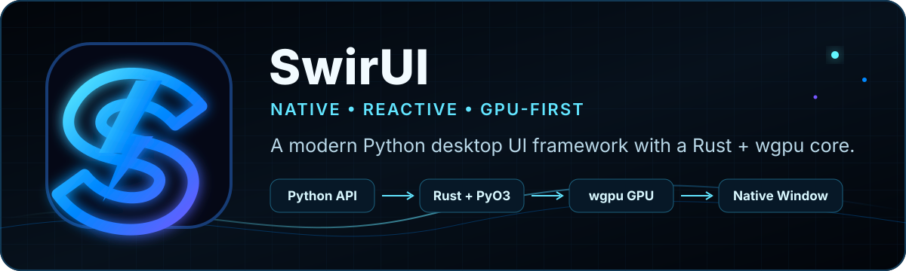

<!-- SWIR-README-STANDARD:v2 -->

<div align="center">



# ⚡ SwirUI

### Native, reactive and GPU-first desktop UI framework for Python

**Python public API • Rust + wgpu native core • High-refresh desktop rendering**


[](https://github.com/Swir/Swirui/actions/workflows/ci.yml)


</div>


## Project Status

**51% — 0.4 Alpha Core Widgets underway; retained status, tooltip and surface controls are implemented and verified.**

`[██████████░░░░░░░░░░] 51%`

- `0.1 Alpha — Foundation` ✅
- `0.2 Alpha — Native Window + First Renderer` ✅
- `0.3 Alpha — Visual Engine` ✅
- `0.4 Alpha — Core Widgets` 🚧

Progress increases only for implemented and verified roadmap work. Documentation-only changes, skeletons and unfinished experiments do not increase the percentage.

SwirUI remains **pre-alpha**. Public APIs may still change while the widget, layout, reactive and animation layers are developed. There is no public GitHub Release yet.

## Overview

SwirUI is being built as a complete Python desktop application framework rather than a visual skin over Tkinter, Qt or another widget toolkit. Python stays the public developer API while Rust, wgpu and PyO3 own performance-critical native rendering work.

The Windows renderer uses a persistent per-window wgpu context and retained SceneGraph. Linux/X11 and macOS/Cocoa already provide real native window and input backends. GPU presentation on Linux/macOS and Wayland support remain future work and are not claimed as complete.

## Highlights

| Area | Current verified capability |
|---|---|
| Native windows | Direct Win32, X11 and Cocoa/AppKit backends without Tkinter, Qt or SDL |
| GPU renderer | Persistent Rust/wgpu renderer context on Windows with retained scene submission |
| Shapes | Anti-aliased rounded rectangles plus convex/concave `Path2D` geometry |
| Text | Persistent shaped Unicode text through glyphon/cosmic-text |
| Images | Content-addressed RGBA GPU cache with aliases, telemetry and safe lifetime management |
| Composition | Hierarchical clipping, cumulative opacity and painter-order retained composition |
| HiDPI | Logical-DIP public geometry with physical-pixel native/GPU conversion |
| Displays | Multi-monitor mapping, refresh discovery and 60/120/144+ Hz display-aware pacing |
| Visual Engine | Gradients, shadows, glow, bloom, depth, parallax, reflections and adaptive lighting |
| Materials | Native backdrop blur, `FrostedGlass` and `Acrylic` with deterministic grain |
| Post-processing | Persistent scene blur, affine RGBA color filters and validated custom WGSL effects |
| Custom shaders | Bounded Python `CustomShaderEffect` API, native Naga validation, persistent GPU pass and bounded pipeline reuse |
| Core widgets | Retained Text/Label, Button/IconButton, text inputs, toggles, Slider/RangeSlider, determinate progress, Badge/Chip, Tooltip, Panel/Frame and Card/GlassCard |
| Performance | Adaptive visual-quality profiles plus retained effect and GPU resource caches |
| Accessibility | Semantic roles/tree, keyboard focus routing, keyboard-only traversal, checked state and numeric value/range semantics |

## Quick Start

### Python development environment

```powershell
git clone https://github.com/Swir/Swirui.git
cd Swirui
python -m venv .venv
.venv\Scripts\activate
python -m pip install --upgrade pip
python -m pip install -e ".[dev]"
```

Run the native-window demo:

```powershell
python examples/native_window_demo.py
```

Try the retained core widgets:

```powershell
python examples/core_widgets_demo.py
python examples/core_toggles_demo.py
python examples/range_progress_demo.py
python examples/core_surfaces_demo.py
```

### Windows GPU development

The verified wgpu presentation path currently targets Windows. Build the PyO3 extension into the active environment:

```powershell
python -m pip install maturin==1.15.0
cd native
maturin develop --release
cd ..
python examples/gpu_rectangles_demo.py
```

Try the custom-shader runtime after building the native extension:

```powershell
python examples/gpu_custom_shader_demo.py
```

## Requirements & Compatibility

| Area | Status |
|---|---|
| Python | 3.11, 3.12, 3.13 and 3.14 are tested in CI |
| Windows | Native Win32 backend + verified Rust/wgpu presentation path |
| Linux | Native X11 window/input backend verified under Xvfb |
| macOS | Native Cocoa/AppKit window/input backend with Retina logical geometry |
| Wayland | Planned |
| Linux/macOS GPU presentation | Planned; not yet claimed |
| Native GPU build | Stable Rust toolchain + Maturin + PyO3 ABI3 |

## Usage

Foundation API:

```python
from swirui import App, AppConfig, Component, State, Window

counter = State(0)

app = App(
    name="SwirUI Demo",
    config=AppConfig(target_fps=120),
)
window = Window(
    title="Future starts here",
    width=1100,
    height=720,
)

root = Component("dashboard")
window.set_root(root)
app.add_window(window)

counter.subscribe(lambda value: print("Counter:", value))
counter.set(1)

app.run()
```

When the native GPU extension is installed on Windows, SwirUI can select the wgpu renderer automatically. Explicit renderer injection remains available for tests and custom backends.

### Bounded custom WGSL effect

Custom effects receive the already rendered pixel color, normalized UV coordinates and a four-float parameter block. SwirUI owns texture/sampler bindings, entry points, validation and pipeline lifecycle.

```python
from swirui.rendering import CustomShaderEffect, WgpuRenderer

source = """
fn swirui_effect(
    color: vec4<f32>,
    uv: vec2<f32>,
    params: vec4<f32>,
) -> vec4<f32> {
    let gain = 1.0 + params.x;
    return vec4<f32>(color.rgb * gain, color.a);
}
"""

effect = CustomShaderEffect(source, parameters=(0.15, 0.0, 0.0, 0.0))
renderer = WgpuRenderer(custom_shader=effect)
```

Changing only the four parameters updates a small native uniform buffer. Changing to a new validated source creates a new GPU pipeline, while recently used pipelines are retained in a bounded native cache.

### GPU and runtime examples

```text
examples/core_widgets_demo.py
examples/core_toggles_demo.py
examples/range_progress_demo.py
examples/core_surfaces_demo.py
examples/gpu_rectangles_demo.py
examples/gpu_text_demo.py
examples/gpu_image_demo.py
examples/gpu_paths_demo.py
examples/gpu_gradients_demo.py
examples/gpu_mesh_gradients_demo.py
examples/gpu_depth_demo.py
examples/gpu_reflections_demo.py
examples/gpu_dynamic_effects_demo.py
examples/gpu_bloom_demo.py
examples/gpu_noise_demo.py
examples/gpu_adaptive_lighting_demo.py
examples/gpu_scene_blur_demo.py
examples/gpu_backdrop_blur_demo.py
examples/gpu_glass_materials_demo.py
examples/gpu_color_filters_demo.py
examples/gpu_custom_shader_demo.py
examples/gpu_native_effect_frame_cache_demo.py
examples/adaptive_quality_demo.py
examples/high_refresh_demo.py
```

These examples exercise the same retained contracts used by applications. Public geometry remains in logical DIPs while native surfaces and GPU submission operate in physical pixels.

## Technology & Architecture

```text
Python Application API
        │
        ├── App / Window / Component / State
        ├── Routed input + accessibility semantics
        └── Runtime configuration + adaptive visual quality
        │
SwirUI Runtime
        │
        ├── Win32 / X11 / Cocoa native backends
        ├── logical DIP ↔ physical pixel boundary
        ├── retained RenderTree / SceneGraph
        └── display-aware frame scheduler
        │
Renderer Layer
        │
        ├── persistent Windows wgpu context
        ├── rectangles / paths / shaped text / images
        ├── blur / backdrop / glass / acrylic
        ├── gradients / depth / lighting / bloom / color filters
        ├── validated custom WGSL post-processing
        └── retained GPU/effect/pipeline caches
        │
Native Core
        │
        └── Rust 2024 + wgpu 30 + PyO3 ABI3
```

Custom shader execution is deliberately narrow rather than arbitrary GPU access. The Python contract rejects additional bindings, texture operations, workgroup state and unbounded loops. Composed WGSL is validated natively, then executed as a persistent fullscreen post-process after blur and color filtering. The renderer retains the effect target and a bounded cache of compiled pipelines across frames.

## Testing & Quality

Every significant runtime change is expected to preserve the existing quality gates:

- Ruff and strict Mypy
- pytest on Python 3.11–3.14
- retained-runtime performance budgets with JSON reports
- `cargo check` and `cargo test`
- Maturin / PyO3 native build
- real Linux/X11 and macOS/Cocoa native-window smoke tests
- real Win32 + wgpu smoke tests
- integrated 0.2 native renderer/runtime gate
- HiDPI, multi-monitor, presentation-policy, text, image, path, effects and cache coverage
- retained widget interaction, accessibility and real Win32 input/rendering coverage
- real custom-WGSL validation and persistent-runtime smoke coverage

SwirUI does not claim performance superiority over other frameworks without reproducible measurements.

## Roadmap

The authoritative plan is **[ROADMAP.md](ROADMAP.md)**.

**0.4 Alpha — Core Widgets** is underway. The verified retained control surface now includes Text/Label, Button/IconButton, Input/PasswordInput/TextArea, Checkbox/RadioButton/Switch, Slider/RangeSlider, ProgressBar/ProgressRing, Badge/Chip, Tooltip, Panel/Frame and Card/GlassCard. Remaining 0.4 work continues with scrolling, expandable/split containers, dialogs and notification surfaces.

## Releases

There is currently **no public GitHub Release** for SwirUI. Development remains source-first while the pre-alpha gates are being completed.

- Development history: **[CHANGELOG.md](CHANGELOG.md)**
- Full roadmap: **[ROADMAP.md](ROADMAP.md)**
- CI status: **[GitHub Actions](https://github.com/Swir/Swirui/actions)**

## Repository Structure

```text
Swirui/
├── .github/workflows/      # Python, Rust and native-platform CI
├── assets/                 # SwirUI icon and README artwork
├── benchmarks/             # reproducible performance budgets
├── docs/                   # architecture documentation
├── examples/               # native/runtime/GPU examples
├── native/                 # Rust + wgpu + PyO3 core
├── src/swirui/             # public Python framework and renderer bridge
├── tests/                  # automated unit/integration/native smoke tests
├── CHANGELOG.md
├── CONTRIBUTING.md
├── ROADMAP.md
└── pyproject.toml
```

## 🔎 Search Keywords

`python desktop gui` • `python gpu ui` • `native python ui framework` • `python retained widgets` • `wgpu python renderer` • `rust pyo3 gui` • `win32 python gui` • `reactive desktop ui` • `high refresh rate ui` • `hidpi desktop ui` • `gpu text rendering` • `frosted glass ui` • `acrylic desktop ui` • `python glass card ui` • `custom wgsl effects` • `multi monitor python ui`


<div align="center">


### `BUILD • TEST • RENDER • EVOLVE`

⭐ **If SwirUI is useful or interesting, consider leaving a star.**

[**← SWIR profile**](https://github.com/Swir) · [**All projects →**](https://github.com/Swir?tab=repositories)

</div>
