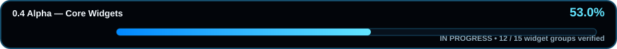

# SwirUI Roadmap

> Next-generation Python UI framework: native, GPU-first, reactive, beautiful and extensible.

## Project progress



**Overall completion: 68%**

Progress is based on implemented and verified roadmap work. Ideas, mockups and unfinished prototypes do not increase the percentage. The current weighted model preserves the verified 56% baseline through completed 0.4 Core Widgets, then adds one percentage point for each verified 0.5 Layout Engine group. Release readiness is tracked separately from project completion. Later milestone checklists record newly verified scope without inventing an unapproved weighting rule or double-counting work already represented by the authoritative project-progress model.

---

## 0.1 Alpha — Foundation

**Status:** Complete ✅

- [x] Repository initialized
- [x] Package metadata and development tooling
- [x] Application lifecycle
- [x] Window lifecycle/model
- [x] Component tree
- [x] Event system
- [x] Reactive `State`
- [x] Configuration system
- [x] Logging system
- [x] Renderer abstraction
- [x] Platform abstraction
- [x] Automated tests
- [x] CI on Python 3.11–3.14
- [x] Architecture documentation

## 0.2 Alpha — Native Window + First Renderer

**Status:** Complete ✅

### Native runtime

- [x] Direct Windows native backend using Win32 + `ctypes`
- [x] Native Win32 HWND creation without Tkinter / Qt / SDL
- [x] x64-safe Win32 handle bindings
- [x] Native event-loop integration
- [x] Window-level input normalization
- [x] Close / resize / focus events
- [x] Mouse move / button events
- [x] Keyboard down / up events
- [x] Text-input events
- [x] Automatic platform backend selection
- [x] Automatic renderer selection on Windows: wgpu first, preview fallback
- [x] Windows-native smoke test on GitHub Actions
- [x] Exact decorated Win32 client-area sizing across create and programmatic resize
- [x] DPI-aware native minimum-track sizing
- [x] Logical client geometry preserved across Win32 DPI transitions
- [x] Scene-level z-aware hit testing
- [x] Pointer events enriched with SceneGraph target + ancestry path
- [x] Pointer enter / leave transitions
- [x] SceneNode-to-Component mapping by stable key
- [x] Routed capture / target / bubbling component pointer input
- [x] Event propagation cancellation
- [x] Linux native backend
- [x] macOS native backend

### Rendering runtime

- [x] Render tree
- [x] Scene graph
- [x] Geometry and color primitives
- [x] Frame scheduler
- [x] Invalidation-driven rendering
- [x] Backend-neutral `RenderSurface` lifecycle
- [x] Runtime surface recreation on resize
- [x] `AppConfig.target_fps` connected to frame scheduling
- [x] Runtime target-FPS retargeting and deadline-aware frame pacing
- [x] Real GPU surface / swapchain on Windows via Rust + wgpu
- [x] GPU adapter/device/queue creation
- [x] Verified clear → submit → present to a real SwirUI HWND
- [x] ABI3 PyO3 native wheel build for Python 3.11+
- [x] SceneGraph rectangle submission to the GPU renderer
- [x] Instanced filled-rectangle GPU pipeline
- [x] Single draw call for a batch of rectangle instances
- [x] Persistent wgpu renderer context per window
- [x] Surface/device/queue/pipeline reused across frames
- [x] Persistent GPU context survives resize/reconfiguration
- [x] Anti-aliased GPU rounded rectangles using `CornerRadius`
- [x] Per-corner radii carried through Python → Rust → WGSL
- [x] SDF/fwidth rounded-edge antialiasing
- [x] General shape / path rendering
- [x] Text rendering
- [x] Image rendering
- [x] Clipping and compositing
- [x] Robust DPI / HiDPI handling
- [x] Multi-monitor support
- [x] Display-aware 60 / 120 / 144+ Hz presentation
- [x] VSync / present-mode selection

### 0.2 gate

0.2 is complete when SwirUI can open a native window and render a visible GPU-backed scene containing shapes and text while handling resize and input correctly, with the milestone's renderer/runtime hardening complete enough to support the first real widgets.

The verified Windows integration gate exercises one real native session containing clipped rounded shapes, Unicode text, an image and a concave path while also checking exact client-area resize, persistent GPU-context reuse and routed native pointer/focus input.

Cross-platform native-window coverage now includes real Linux/X11 lifecycle/input verification under Xvfb and a direct macOS Cocoa/AppKit backend with real NSWindow lifecycle, normalized input and Retina logical-geometry verification. Linux/macOS GPU/wgpu presentation and Wayland remain separate future work and are not implied by the 0.2 native-window milestone.

## 0.3 Alpha — Visual Engine

**Status:** Complete ✅

- [x] Glass / frosted glass
- [x] Acrylic-like materials
- [x] Background blur
- [x] Glow and bloom
- [x] Dynamic shadows
- [x] Linear / radial / mesh gradients
- [x] Reflections
- [x] Depth and perspective
- [x] Adaptive lighting
- [x] Parallax
- [x] Color filters
- [x] Noise / grain
- [x] Custom shader effects
- [x] Effect caching
- [x] Adaptive quality profiles: Performance / Balanced / Quality / Ultra / Cinematic

### 0.3 gate

The Visual Engine gate is complete with verified retained effects/materials, persistent native post-processing and adaptive-quality/caching behavior. Custom effects use a bounded Python-authored WGSL contract, native Naga validation, a persistent Rust/wgpu fullscreen pass, four-float uniform updates and a bounded compiled-pipeline cache. Real Win32/wgpu smoke coverage verifies execution in the same persistent per-window context alongside blur and color filtering.

## 0.4 Alpha — Core Widgets

**Status:** Complete ✅

- [x] Text / Label
- [x] Button / IconButton
- [x] Input / PasswordInput / TextArea
- [x] Checkbox / RadioButton / Switch
- [x] Slider / RangeSlider
- [x] ProgressBar / ProgressRing
- [x] Badge / Chip
- [x] Tooltip
- [x] Card / GlassCard
- [x] Panel / Frame
- [x] ScrollView
- [x] Expander / Accordion
- [x] SplitView
- [x] Modal / Dialog
- [x] Toast / Notification surface

### 0.4 gate

The Core Widgets gate is complete with all 15 retained widget groups implemented as Python public APIs and compiled through the SceneGraph. Pointer and keyboard routing, focus/accessibility semantics, deterministic component tests and real Win32/wgpu smoke coverage protect interactive controls while the renderer keeps one persistent per-window GPU context. Completion applies to the named 0.4 milestone only and does not imply release readiness.

## 0.5 Alpha — Layout Engine

**Status:** Complete ✅

- [x] Row / Column
- [x] Stack / Grid / Wrap
- [x] Dock / Flow / Overlay
- [x] Constraint layout
- [x] Intrinsic sizing
- [x] Min / max constraints
- [x] Responsive breakpoints
- [x] Adaptive navigation
- [x] Dynamic typography
- [x] Compact / desktop / ultrawide variants
- [x] DPI-aware spacing
- [x] Layout invalidation optimization

### 0.5 gate

The Layout Engine gate is complete with all 12 named groups implemented and verified. Retained `Row`, `Column`, `Stack`, weighted `Grid`, `Wrap`, `DockPanel`, bidirectional `Flow`, independently aligned `Overlay` and parent-relative `ConstraintLayout` containers support content-aware intrinsic measurement, shared min/max constraints and stable authored preferred sizes across reflow. Responsive layout policies keep one retained tree across compact, desktop and ultrawide logical-DIP widths, with adaptive navigation and `DynamicTypography` preserving component identity, focus state and shaped-text rendering.

Layout spacing and padding remain authored in logical DIPs across monitor-scale changes and are converted only at the native/GPU boundary, preventing spacing drift while physical pixels follow the active display scale. Layout preparation is cached by geometry-relevant revision plus logical viewport, so paint/input-only invalidations avoid redundant measure/arrange work while content, layout and resize changes still force correct reflow. Deterministic Python coverage, real Win32+wGPU responsive/layout smoke tests and the existing mixed-DPI GPU gate protect the completed milestone while preserving one persistent per-window GPU context. Completion applies only to 0.5 and does not imply release readiness.

## 0.6 Alpha — Reactive Runtime

**Status:** Complete ✅ — 12 / 12 groups verified

- [x] Basic thread-safe `State`
- [x] Computed state
- [x] Reactive properties
- [x] Data binding
- [x] Two-way binding
- [x] Observable collections
- [x] Dependency tracking
- [x] Async state
- [x] Persistent state
- [x] Component lifecycle hooks
- [x] Minimal-update scheduling
- [x] Batched state transactions

### Verified 0.6 slice

`ComputedState` is read-only and discovers dependencies dynamically from reactive reads. Nested `state_transaction()` scopes coalesce notifications and recompute computed chains in dependency order at the outer boundary. `ReactiveProperty`, disposable one-way/two-way bindings, `ObservableList` and `ObservableDict` remain public Python APIs with deterministic dependency, batching, disposal and snapshot coverage.

`AsyncState` adds `asyncio`-driven loading/ready/error snapshots, cancellation/replacement of stale operations, overlap protection and computed-state dependency participation. `PersistentState` provides reactive schema-versioned JSON persistence, atomic writes, reload, custom codecs and failure-safe publication. Retained `Component` lifecycle hooks now cover mount/update/unmount ordering, dynamic children and close-time unmounting, while transaction-scoped `WidgetRuntime` invalidation coalesces retained updates instead of scheduling redundant work. The merged implementations passed the full repository CI gate before the milestone was marked complete. Completion applies only to 0.6 and does not imply release readiness.

## 0.7 Alpha — Animation Engine

**Status:** Complete ✅ — 12 / 12 groups verified

- [x] Fade / slide / scale / rotate
- [x] Blur / glow transitions
- [x] Morph / flip / reveal
- [x] Spring / elastic / bounce
- [x] Physics animations
- [x] Page transitions
- [x] Shared-element transitions
- [x] Hover / press / focus animations
- [x] Magnetic interactions
- [x] Particle effects
- [x] Frame-rate-independent timing
- [x] Animation cancellation / chaining

### Verified 0.7 slice

`Tween` and the window-scoped `AnimationController` advance from elapsed rendered-frame time rather than frame counts, with exact completion, unused-frame-tail carry-over and deterministic cancellation/chaining. Easing includes cubic, bounce and elastic curves. Analytical `SpringAnimation` solves underdamped, critically damped and overdamped motion from absolute elapsed time, while `DecayAnimation` provides exponential inertial motion for momentum/fling behavior. `AnimationParallel` composes multiple playables against one frame clock and interoperates with serial `AnimationSequence`; spring, decay and tween helpers publish samples through reactive `State`.

Retained interaction helpers cover hover/press/focus opacity transitions, animated blur/glow effect transitions, particle effects and spring-driven magnetic interaction. Magnetic motion uses a visual-only logical-DIP widget offset, retargets from the currently presented sample, leaves layout measurement/arrangement unchanged and translates the compiled subtree so painting, clipping and hit testing stay aligned. Deterministic tests cover clamping, retargeting, idle restoration and finite parameter validation, while real Win32+wGPU smoke coverage verifies routed pointer motion, retained SceneGraph translation and persistent per-window GPU-context reuse.

`PageTransition` now performs retained slide-and-cross-fade navigation without mutating authored layout bounds, while `SharedElementTransition` aligns two retained representations by their visual centers, cross-fades them along one logical path and preserves their pre-existing visual offsets. Both are driven by the same elapsed-time animation clock and compile through the retained SceneGraph, so clipping and hit testing track the sampled visual position without recreating the native window or persistent wgpu context. Deterministic unit coverage protects frame-partition independence, cancellation, restoration and boundary cases, and dedicated real Win32+wGPU smoke gates verify persistent-context reuse.

`MorphTransition` aligns positive, matching-aspect retained source/target elements by visual center, interpolates their verified uniform visual scales and cross-fades them without mutating authored layout. `FlipTransition` provides a deterministic center-collapse flip with a single midpoint content-swap hook, while `RevealTransition` combines retained scale and opacity from a configurable hidden state back to the captured authored visual state. Exact-head CI #697 verified these APIs across Python 3.11–3.14, strict Ruff/Mypy, performance budgets, Rust cargo check/test, Maturin/PyO3, Linux/X11, macOS/Cocoa and the real Win32+wGPU persistent-context smoke gate before this eleventh 0.7 group was credited.

`RotateTransition` completes the transform group with center-origin retained rotation and geometry-accurate hit testing while preserving authored layout. Arbitrary-affine shaped text now remains native-shaped: rotation, shear, reflection, non-uniform scale and non-axis clips are rasterized through cosmic-text into bounded cached RGBA resources, then transformed and clipped by the verified affine image/wgpu path. Exact-head CI #774 and Native Affine Contract #32 passed on PR #118 before merge, including the real Win32+wGPU RotateTransition shaped-text smoke. Completion applies only to 0.7 and does not imply beta or release readiness.

## 0.8 Beta — Professional Widgets

**Status:** Complete ✅ — 13 / 13 groups verified

- [x] DataGrid / Table
- [x] TreeView / ListView
- [x] Virtualized collections
- [x] Tabs
- [x] Docking system
- [x] Sidebar / NavigationRail
- [x] Toolbar / Ribbon / MenuBar
- [x] ContextMenu / CommandPalette
- [x] PropertyGrid / Inspector
- [x] Timeline
- [x] Calendar / DatePicker / TimePicker
- [x] ColorPicker
- [x] FilePicker / FolderPicker

### Verified 0.8 closeout

The Professional Widgets milestone is closed only from merged exact-head evidence. `DataGrid / Table` reached its integrated acceptance gate in PR #133 with CI #840 after the preceding retained editing, filtering, selection, accessibility, two-axis virtualization and native-input slices; `TreeView / ListView` and the named virtualized-collections capability were then accepted in PR #134 with CI #844, including 2,000-item viewport-bounded retained rendering. `Tabs` was accepted in PR #135 with CI #849, whose real Win32 + wgpu job completed the retained-professional-widgets verification path.

Dedicated native gates then qualified the remaining groups before merge: Docking PR #136 / CI #851 / Docking Native Gate #1; Sidebar / NavigationRail PR #137 / CI #853 / Navigation Native Gate #1; Toolbar / Ribbon / MenuBar PR #138 / CI #856 / Command Surfaces Native Gate #2; ContextMenu / CommandPalette PR #139 / CI #858 / Context Commands Native Gate #1; PropertyGrid / Inspector PR #140 / CI #861 / Property Grid Native Gate #2; Timeline PR #141 / CI #865 / Timeline Native Gate #3; Calendar / DatePicker / TimePicker PR #142 / CI #869 / Date Time Native Gate #3; ColorPicker PR #143 / CI #873 / Color Picker Native Gate #3; and FilePicker / FolderPicker PR #144 / CI #878 / File Picker Native Gate #4. Completion applies only to the named 0.8 Professional Widgets milestone and does not by itself publish a Beta release.

This checklist closeout synchronizes canonical roadmap truth with already-merged qualification evidence. It does not alter the authoritative weighted project percentage, which remains 68% because the approved weighting model has not been extended beyond completed 0.5 scope.

## Data Visualization

**Status:** Complete ✅ — 8 / 8 groups verified

- [x] Line / area / bar charts
- [x] Pie / donut charts
- [x] Scatter / heatmap / radar
- [x] Gauge / candlestick / timeline charts
- [x] Live and streaming data
- [x] GPU chart rendering
- [x] Interactive zoom and selection
- [x] Large-dataset optimization

The merged chart packages are synchronized here without widening scope: PR #145 passed exact-head CI #883 plus Cartesian Charts Native Gate #4 for retained line/area/bar charts; PR #146 passed exact-head CI #888 plus Radial Charts Native Gate #4 for retained pie/donut charts; PR #148 passed exact-head CI #894 plus Advanced Charts Native Gate #3 for retained scatter/heatmap/radar charts; PR #150 passed exact-head CI #900 plus Specialized Charts Native Gate #1 for retained gauge/candlestick/timeline charts; PR #152 passed exact-head CI #904 plus Streaming Charts Native Gate #1 for bounded live/streaming data before merge, with main CI #905 also passing afterward; PR #154 passed exact-head CI #908 plus GPU Charts Native Gate #1 before merge, qualifying cross-family retained chart submission through one persistent Win32 + wgpu context; PR #156 passed exact-head CI #912 plus Interactive Charts Native Gate #1 before merge, qualifying anchored wheel/keyboard zoom, pointer/keyboard point selection, accessibility state and retained viewport-aware rendering; and PR #158 passed exact-head CI #918 plus Large Dataset Charts Native Gate #3 before merge, qualifying bounded 100k-point retained projections, cached domains/projections, bounded accessibility fan-out and exact source-data selection, with post-merge main CI #919 and Large Dataset Charts Native Gate #4 also passing. No additional project-percentage points are claimed by this post-0.5 work. Completion closes only the named Data Visualization checklist and opens no Media Engine or Advanced Application Components scope.

## Media Engine

**Status:** In progress — 5 / 8 groups verified

- [x] Image / SVG / GIF
- [x] Lottie
- [x] VideoPlayer
- [x] AudioPlayer
- [x] CameraView
- [ ] Microphone input
- [ ] Waveform
- [ ] Spectrum visualizer

`Image / SVG / GIF` is credited only from merged qualification evidence: PR #160 passed exact-head CI #925 and Media Image Native Gate #4 before merge, then the resulting `main` head passed CI #926 and Media Image Native Gate #5. `Lottie` is credited only from merged qualification evidence: PR #162 passed exact-head CI #935 and Media Lottie Native Gate #7 before merge, then the resulting `main` head passed CI #936 and Media Lottie Native Gate #8. `VideoPlayer` is credited only from merged qualification evidence: PR #164 passed exact-head CI #940 and Media Video Native Gate #2 before merge, then the resulting `main` head passed CI #941 and Media Video Native Gate #3. `AudioPlayer` is credited from the complete merged qualification chain: PR #166 passed exact-head CI #944 and Media Audio Native Gate #1 before merge; the merged AudioPlayer head passed Media Audio Native Gate #2; after main CI #945 exposed an unrelated Win32 scheduler timing regression, hotfix PR #167 passed exact-head CI #946 and the resulting `main` head passed CI #947. `CameraView` is credited only from the complete merged qualification chain: PR #169 passed exact-head CI #950 and Media Camera Native Gate #1 before merge, then the resulting `main` head passed CI #951 and Media Camera Native Gate #2. The authoritative weighted project percentage remains 68%; this post-0.5 checklist synchronization does not invent additional weighted points.

## Advanced Application Components

- [ ] Terminal
- [ ] Code editor
- [ ] Syntax highlighting
- [ ] Autocomplete
- [ ] Minimap
- [ ] Markdown viewer
- [ ] PDF viewer
- [ ] WebView
- [ ] JSON / log / hex viewers
- [ ] File explorer
- [ ] Settings framework

## 2D / 3D

- [ ] Canvas2D
- [ ] Infinite canvas
- [ ] GPU drawing API
- [ ] 3D viewport
- [ ] Cameras / scenes / meshes
- [ ] Materials / lighting
- [ ] Model viewer
- [ ] Interactive 3D widgets

## Theme Engine

- [ ] Future Dark / Future Light
- [ ] Neon Blue / Neon Green
- [ ] Matrix / Cyberpunk
- [ ] Glass / Adaptive Glass
- [ ] OLED / Minimal / Professional
- [ ] Runtime theme switching
- [ ] System-theme synchronization
- [ ] Theme inheritance
- [ ] Custom theme packages
- [ ] Animated theme transitions
- [ ] Design tokens

## Desktop Integration

- [ ] Clipboard
- [ ] Drag & drop
- [ ] System tray
- [ ] Native notifications
- [ ] Global hotkeys
- [ ] File associations
- [ ] URL handlers
- [ ] Native dialogs
- [ ] Taskbar integration
- [ ] Multi-instance management

## Input & Accessibility

- [x] Window-level keyboard / mouse normalization on Windows
- [x] Scene-level pointer hit testing and hover transitions
- [x] Capture / target / bubble pointer routing
- [x] Event propagation cancellation
- [x] Keyboard focus routing
- [ ] Touch / gestures
- [ ] Pen / pressure
- [ ] Gamepad navigation
- [ ] Screen readers
- [x] Keyboard-only navigation
- [x] Focus management
- [ ] High contrast
- [ ] Reduced motion
- [ ] Font scaling
- [x] Semantic roles
- [ ] Accessibility inspector

## Internationalization

- [ ] System-language detection
- [ ] English fallback
- [ ] Runtime language switching
- [ ] RTL layouts
- [ ] Locale-aware dates / numbers / currencies
- [ ] Translation packages
- [ ] IME support

## Async & Performance

- [ ] `asyncio` integration
- [ ] Background tasks
- [ ] Worker threads
- [x] Thread-safe state updates
- [ ] Multiprocessing helpers
- [ ] Cancellation
- [ ] Progress reporting
- [x] Performance budgets
- [x] Frame-time telemetry

## Plugin System & Marketplace

- [ ] Plugin API
- [ ] Plugin discovery
- [ ] Widget plugins
- [ ] Theme plugins
- [ ] Renderer plugins
- [ ] Dependency resolution
- [ ] Security model
- [ ] SwirUI Marketplace

## SwirUI Studio

- [ ] Drag-and-drop editor
- [ ] Component tree
- [ ] Property inspector
- [ ] Theme editor
- [ ] Animation timeline
- [ ] Responsive preview
- [ ] Live preview
- [ ] Code preview
- [ ] Asset manager
- [ ] Python code generation
- [ ] Import existing SwirUI projects
- [ ] Round-trip editing
- [ ] Hot reload

## AI Builder

- [ ] Prompt-to-layout
- [ ] Prompt-to-component
- [ ] Prompt-to-theme
- [ ] Prompt-to-animation
- [ ] Responsive variant generation
- [ ] Accessibility suggestions
- [ ] Refactoring assistance
- [ ] Debugging assistance

AI output must remain ordinary, editable SwirUI code.

## Developer Tools

- [ ] SwirUI Inspector
- [ ] Component tree debugger
- [ ] Layout debugger
- [ ] State inspector
- [ ] Event inspector
- [ ] Animation inspector
- [ ] GPU profiler
- [ ] FPS / frame-time monitor
- [ ] Memory profiler
- [ ] Hot reload server

## Testing

- [x] Unit-test foundation
- [x] Headless native-window test backend
- [x] Linux real-X11 native-window smoke test
- [x] macOS real-Cocoa native-window + Retina logical-geometry smoke test
- [x] Windows real-native-window smoke test
- [x] Windows integrated 0.2 mixed-scene + exact-client + routed-input gate
- [x] Windows active-display / refresh-rate mapping smoke test
- [x] Windows `WM_DISPLAYCHANGE` / `WM_DPICHANGED` normalization smoke tests
- [x] Windows keyboard / system-key normalization smoke test
- [x] Windows real-wgpu surface/present smoke test
- [x] Windows real-wgpu instanced rectangle draw smoke test
- [x] Windows persistent GPU context multi-frame + resize smoke test
- [x] Windows per-corner rounded-rectangle shader smoke test
- [x] Windows shaped-text SceneGraph → Python → Rust/wgpu smoke test
- [x] Windows arbitrary-affine shaped-text + RotateTransition persistent wgpu smoke test
- [x] Windows image-resource SceneGraph → Python → Rust/wgpu smoke test
- [x] Windows filled Path2D SceneGraph → Python → Rust/wgpu smoke test
- [x] Windows retained linear / radial / mesh gradient GPU smoke tests
- [x] Windows retained depth / perspective / parallax / reflections GPU smoke test
- [x] Windows retained adaptive-lighting / glow / bloom / noise GPU smoke test
- [x] Windows retained backdrop/background-blur + glass/acrylic GPU smoke test
- [x] Windows retained native effect-frame cache smoke test
- [x] Windows native GPU color-filter postprocess smoke test
- [x] Windows validated custom-WGSL persistent GPU postprocess smoke test
- [x] Windows mixed-DPI logical-DIP → physical-GPU smoke test
- [x] Windows presentation-policy reconfiguration smoke test
- [x] Display-aware high-refresh runtime pacing tests
- [x] Rust native-core check and unit tests
- [x] ABI3 native extension build on Windows
- [x] Python 3.11–3.14 test matrix
- [x] Ruff quality gate
- [x] Mypy quality gate
- [x] SceneGraph hit-test and pointer-targeting tests
- [x] Routed component input propagation tests
- [x] Widget interaction tests
- [x] Windows retained ScrollView + persistent wgpu smoke test
- [x] Windows retained Expander / Accordion + persistent wgpu smoke test
- [x] Windows retained SplitView + persistent wgpu smoke test
- [x] Windows retained Modal / Dialog + Toast / Notification + persistent wgpu smoke test
- [x] Windows retained layout engine + persistent wgpu smoke test
- [x] Windows content-aware intrinsic sizing + persistent wgpu smoke test
- [x] Windows responsive breakpoints + dynamic typography + persistent wgpu smoke test
- [x] Windows adaptive navigation + persistent wgpu smoke test
- [x] Windows advanced Dock / Flow / Overlay / ConstraintLayout + persistent wgpu smoke test
- [x] Windows spring-driven magnetic interaction + persistent wgpu smoke test
- [x] Windows retained page transitions + persistent wgpu smoke test
- [x] Windows retained shared-element transitions + persistent wgpu smoke test
- [x] Windows retained morph / flip / reveal + persistent wgpu smoke test
- [x] DPI-aware logical spacing / padding conversion coverage
- [x] Retained layout invalidation optimization coverage
- [x] Reactive runtime computed state / bindings / observable collections / transaction coverage
- [x] Async/persistent reactive state + component lifecycle/minimal-update coverage
- [x] Animation timing / analytical physics / composition coverage
- [ ] Screenshot tests
- [ ] Visual regression tests
- [x] Accessibility tests
- [x] Performance regression tests
- [ ] Automated UI testing

## SwirUI CLI

Planned commands:

```bash
swirui new MyApp
swirui dev
swirui run
swirui test
swirui benchmark
swirui build
swirui package
```

## Packaging

- [ ] Windows EXE
- [ ] Windows MSI
- [ ] Portable Windows build
- [ ] Linux AppImage
- [ ] Linux DEB / RPM
- [ ] macOS APP / DMG
- [ ] Android feasibility
- [ ] iOS feasibility
- [ ] Web / WASM feasibility

## Native Core

Python remains the public developer API while performance-critical systems migrate progressively to Rust.

Current native foundation:

- [x] Rust 2024 native crate
- [x] PyO3 bridge
- [x] Maturin native build project
- [x] wgpu 30 renderer foundation
- [x] Windows HWND + DisplayHandle surface bridge
- [x] hardware adapter with software fallback selection
- [x] ABI3 Python 3.11+ native wheel
- [x] Python SceneGraph → native wgpu rectangle bridge
- [x] instanced GPU rectangle pipeline
- [x] persistent renderer context per window
- [x] context reuse across multiple frames and resize
- [x] native per-corner rounded-rectangle pipeline
- [x] native renderer split into dedicated Rust module
- [x] GPU resource cache
- [x] native text pipeline
- [x] native image pipeline
- [x] native filled-path pipeline
- [x] native painter-order backdrop blur/compositor pipeline
- [x] native affine RGBA color-filter postprocess pipeline
- [x] native bounded custom-WGSL postprocess pipeline cache
- [x] native retained backdrop/material effect-frame cache

Primary future candidates:

- GPU rendering
- scene preparation
- text and image processing
- layout acceleration
- animation scheduler
- GPU resource management
- platform integration

## Benchmarks

SwirUI publishes reproducible benchmark guardrails instead of unsupported performance claims. The current CI suite measures retained 1024-node SceneGraph traversal and pointer hit testing plus deterministic 96-step reflection tessellation, with median, p95 and worst-case latency budgets and a machine-readable JSON report artifact for each run.

Metrics planned for continued expansion include:

- startup time
- RAM
- CPU / GPU usage
- frame time
- input latency
- component creation
- large-list / DataGrid performance
- animation performance

Where technically comparable, benchmark targets may include Qt/PyQt/PySide, Tkinter/CustomTkinter, Flet, Kivy, Flutter desktop and Electron-based desktop applications.

## SwirUI Showcase

The official showcase will be a real application rather than a Hello World screen.

- [ ] animated dashboard
- [ ] glass sidebar
- [ ] live charts
- [ ] DataGrid
- [ ] terminal
- [ ] code editor
- [ ] media player
- [ ] 3D viewport
- [ ] settings
- [ ] notifications
- [ ] theme switching
- [ ] responsive layouts
- [ ] live performance monitor

---